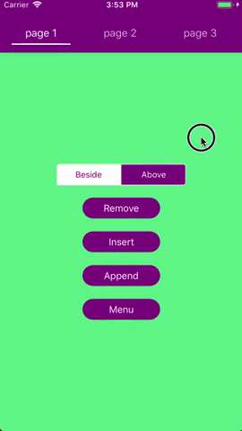
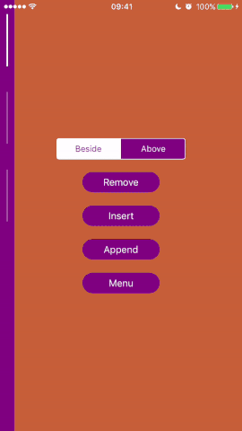
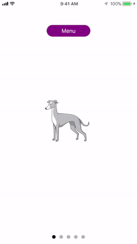

[](https://travis-ci.org/touchlane/SlideController)
[](https://codecov.io/gh/codecov/SlideController/branch/master)
[](http://cocoapods.org/pods/SlideController)
[](http://cocoapods.org/pods/SlideController)
[](http://cocoapods.org/pods/SlideController)

SlideController is a simple and flexible UI component fully written in Swift. Built using power of generic types, it is a nice alternative to UIPageViewController.





# Requirements

* iOS 9.0+
* Xcode 10.2+
* Swift 5.0+

# Installation

## CocoaPods

[CocoaPods](https://cocoapods.org) is a dependency manager for Cocoa projects. You can install it with the following command:

```$ gem install cocoapods```

To integrate SlideController into your Xcode project using CocoaPods, specify it in your ```Podfile```:

```ruby
source 'https://github.com/CocoaPods/Specs.git'
platform :ios, '9.0'
use_frameworks!

target '<Your Target Name>' do
    pod 'SlideController'
end
```

Then, run the following command:

```$ pod install```

# Usage

```swift
import SlideController
```

1) Create content
```swift
let content = [
            SlideLifeCycleObjectBuilder<PageLifeCycleObject>(),
            SlideLifeCycleObjectBuilder<PageLifeCycleObject>(),
            SlideLifeCycleObjectBuilder<PageLifeCycleObject>()
        ]
 ```
 
* ``PageLifeCycleObject`` is any object conforms to ``Initializable, Viewable, SlidePageLifeCycle `` protocols

2) Initialize SlideController
```swift
slideController = SlideController<CustomTitleView, CustomTitleItem>(
    pagesContent: content,
    startPageIndex: 0,
    slideDirection: .horizontal)
```

* ``CustomTitleView`` is subclass of ``TitleScrollView<CustomTitleItem>``
* ``CustomTitleItem`` is subclass of ``UIView`` and conforms to ``Initializable, ItemViewable, Selectable`` protocols

3) Add ``slideController.view`` to view hierarchy

4) Call ``slideController.viewDidAppear()`` and ``slideController.viewDidDisappear()`` in appropriate UIViewController methods:

 ```swift
 override func viewDidAppear(_ animated: Bool) {
     super.viewDidAppear(animated)
     slideController.viewDidAppear()
 }
 ```
 
 ```swift
override func viewDidDisappear(_ animated: Bool) {
    super.viewDidDisappear(animated)
    slideController.viewDidDisappear()
}
```

# Documentation

### SlideController

Default initializer of `SlideController`.  
`pagesContent` - initial content of controller, can be empty.  
`startPageIndex` - page index that should be displayed initially.  
`slideDirection` - slide direction. `.horizontal` or `.vertical`. 
```swift
public init(pagesContent: [SlideLifeCycleObjectProvidable],
            startPageIndex: Int = 0,
            slideDirection: SlideDirection)
```

Returns `titleView` instanсe of `TitleScrollView`.
```swift 
public var titleView: T { get }
```

Returns `LifeCycleObject` for currently displayed page.
```swift
public var currentModel: SlideLifeCycleObjectProvidable? { get }
```

Returns array of `LifeCycleObject` that corresponds to `SlideController`'s content.
 ```swift
public private(set) var content: [SlideLifeCycleObjectProvidable]
```
When set to `true` unloads content when it is out of screen bounds. The default value is `true`.
```swift
public var isContentUnloadingEnabled: Bool { get set }
```

When set to `true` scrolling in the direction of last item will result jumping to the first item.  Makes scrolling infinite. The default value is `false`.
```swift
public var isCarousel: Bool { get set }
```

If the value of this property is `true`, content scrolling is enabled, and if it is `false`, content scrolling is disabled. The default is `true`.
```swift
public var isScrollEnabled: Bool { get set }
```

Appends pages array of `SlideLifeCycleObjectProvidable` to the end of sliding content.
```swift
public func append(object objects: [SlideLifeCycleObjectProvidable])
```

Inserts `SlideLifeCycleObjectProvidable` page object at `index` in sliding content.
```swift
public func insert(object: SlideLifeCycleObjectProvidable, index: Int)
```
Removes a page at `index`.
```swift
public func removeAtIndex(index: Int)
```

Slides content to page at `pageIndex` with sliding animation if `animated` is set to `true`. Using `forced` is not recommended, it will perform shift even if other shift animation in progress or `pageIndex` equals current page. The default value of `animated` is `true`. The default value of `forced` is `false`.
```swift
public func shift(pageIndex: Int, animated: Bool = default, forced: Bool = default)
```

Slides content the next page with sliding animation if `animated` is set to `true`. The default value of `animated` is `true`.
```swift
public func showNext(animated: Bool = default)
```

Lets the `SlideController` know when it is displayed on the screen. Used for correctly triggering `LifeCycle` events.
```swift
public func viewDidAppear()
```

Lets the `SlideController` know when it is not displayed on the screen. Used for correctly triggering `LifeCycle` events.
```swift
public func viewDidDisappear()
```
___
### TitleScrollView

Alignment of title view. Supports `.top`, `.bottom`, `.left`, `.right`. The default value of `alignment` is `.top`.
```swift
public var alignment: SlideController.TitleViewAlignment { get set }
```

The size of `TitleScrollView`. For `.horizontal` slide direction of `SlideController` the `titleSize` corresponds to `height`. For `.vertical` slide direction of `SlideController` the `titleSize` corresponds to `width`.  The default value of `titleSize` is `84`.
```swift 
open var titleSize: CGFloat { get set }
```

Array of title items that displayed in `TitleScrollView`.
```swift
open var items: [TitleItem] { get }
```
___
